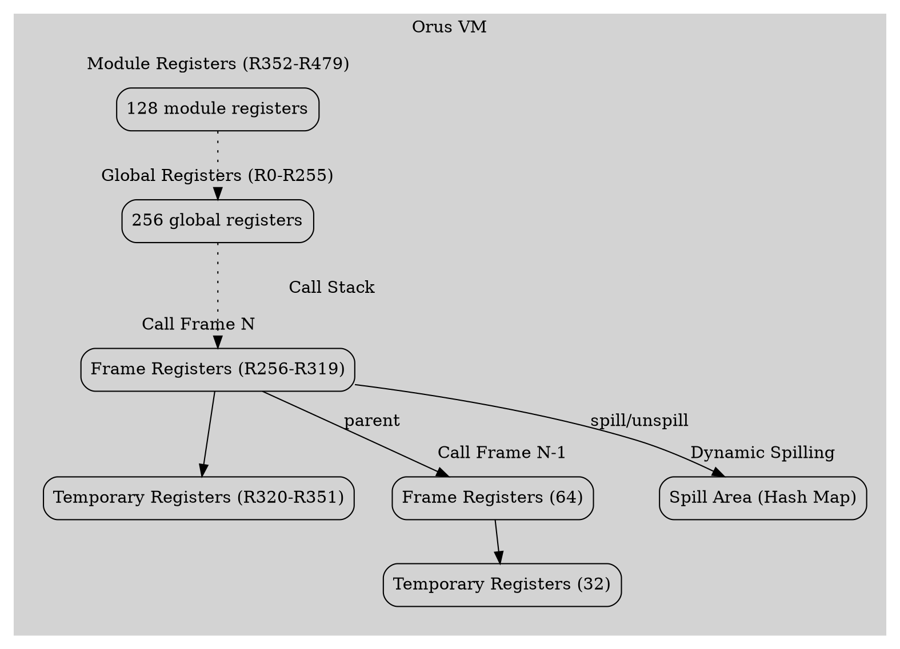

# The Orus Virtual Machine: A High-Performance Register-Based VM for a Statically-Typed Language

## Abstract

The Orus programming language is designed to offer a unique combination of high-level, readable syntax and high-performance execution. At the core of Orus lies a sophisticated register-based virtual machine (VM) that is specifically engineered to support the language's static type system and to deliver performance competitive with established languages like LuaJIT. This paper presents the architecture of the Orus VM, detailing its hierarchical register file, multi-pass compilation pipeline, and extensive instruction set. We demonstrate how these components work in concert to achieve the language's performance goals, with benchmarks showing Orus to be 1.7x faster than Python and 2.2x faster than JavaScript.

## 1. Introduction

The landscape of programming languages is vast and varied, with developers often having to choose between the ease of use of high-level dynamic languages and the performance of low-level statically-typed languages. The Orus language was created to bridge this gap, providing a clean, Python-like syntax with the safety and speed of a compiled, statically-typed language.

To achieve this, Orus relies on a custom-built virtual machine. The Orus VM is a register-based machine, a design choice that is known to offer significant performance advantages over stack-based architectures. The VM is further distinguished by its deep integration with the Orus compiler, which performs extensive type inference and optimization before emitting bytecode.

This paper provides a comprehensive overview of the Orus VM. We will cover:

*   The high-level architecture of the VM, including its hierarchical register file.
*   The multi-pass compiler that generates optimized bytecode for the VM.
*   The rich instruction set that is tailored to the needs of a statically-typed language.
*   Performance benchmarks that demonstrate the effectiveness of our approach.

## 2. VM Architecture

The Orus VM is designed around a hierarchical register file, a key feature that allows it to efficiently manage variables across different scopes. This design is a significant evolution from earlier, simpler models and is critical to the VM's ability to handle large and complex programs.

### 2.1. The Hierarchical Register File

The register file is divided into four main categories:

*   **Global Registers (R0-R255)**: Used for long-lived variables and module-level state.
*   **Frame Registers (R256-R319)**: Allocated for each function call, used for parameters and local variables (64 registers per frame).
*   **Temporary Registers (R320-R351)**: Used for intermediate values during expression evaluation (32 registers).
*   **Module Registers (R352-R479)**: Used for managing imports and exports between different modules (128 registers per module).

This hierarchical structure allows the VM to perform fast, direct register access for most operations, while still providing the flexibility to handle a large number of variables.



### 2.2. Dynamic Spilling

To handle cases where the number of variables exceeds the available registers, the Orus VM implements a dynamic spilling mechanism. When the register file is exhausted, the VM will "spill" the least recently used registers to a hash map in memory. This allows the VM to support a virtually unlimited number of variables, with a graceful degradation in performance.

### 2.3. Call Frame Management

Each function call creates a new call frame that contains:

- Dedicated registers for parameters and local variables
- Pointer to the parent scope frame
- Metadata about register usage
- Return address information

The frame management system enables efficient function calls and returns while maintaining proper scoping rules.

### 2.4. Value Representation System

The VM uses a tagged union for value representation:

```c
typedef struct {
    ValueType type;
    union {
        bool boolean;
        int32_t i32;
        int64_t i64;
        uint32_t u32;
        uint64_t u64;
        double f64;
        double number;
        Obj* obj;  // For heap-allocated objects
    } as;
} Value;
```

This representation allows efficient type-specific operations while supporting a rich type system.

## 3. The Orus Compiler

The Orus compiler is a multi-pass system that is responsible for transforming Orus source code into optimized bytecode. The compiler is designed to work in close concert with the VM, leveraging the VM's features to generate highly efficient code.

### 3.1. The Compilation Pipeline

The compilation process consists of several distinct passes:

1.  **Lexing and Parsing**: The source code is first tokenized and then parsed into an Abstract Syntax Tree (AST).
2.  **Type Inference**: The compiler performs Hindley-Milner type inference on the AST, annotating each node with its static type.
3.  **Optimization**: The typed AST is then passed to an optimization pass, which performs a number of optimizations, including constant folding, loop-invariant code motion, and dead code elimination.
4.  **Code Generation**: Finally, the optimized AST is used to generate bytecode for the Orus VM.

```dot
digraph CompilationPipeline {
    rankdir=LR;
    node [shape=box, style=rounded];

    Source [label="Orus Source Code"];
    AST [label="Abstract Syntax Tree"];
    TypedAST [label="Typed AST"];
    OptimizedAST [label="Optimized Typed AST"];
    Bytecode [label="Orus Bytecode"];

    Source -> AST [label="Lexing & Parsing"];
    AST -> TypedAST [label="Type Inference"];
    TypedAST -> OptimizedAST [label="Optimization Pass"];
    OptimizedAST -> Bytecode [label="Code Generation"];
}
```



### 3.2. Register Allocation

The compiler uses an advanced register allocator with lifetime tracking:

```c
typedef struct {
    int start;              // First instruction where variable is live
    int end;                // Last instruction where variable is live
    uint8_t reg;            // Assigned register
    char* name;             // Variable name
    ValueType type;         // Variable type
    bool spilled;           // Whether variable was spilled to memory
    bool isLoopVar;         // Whether this is a loop induction variable
} LiveRange;
```

This allocator minimizes register spills and enables efficient reuse of registers across scopes.

## 4. The VM Instruction Set

The Orus VM has a rich and comprehensive instruction set, with over 135 opcodes. The instruction set is designed to be a good target for a statically-typed language, with many opcodes being specialized for specific types.

### 4.1. Instruction Format

All instructions are 4 bytes long and follow a consistent format:

```
┌─────────────┬─────────────┬─────────────┬─────────────┐
│   Opcode    │  Target Reg │  Source1    │  Source2    │
│   (8 bit)   │   (8 bit)   │  (8 bit)    │  (8 bit)    │
└─────────────┴─────────────┴─────────────┴─────────────┘
```

### 4.2. Instruction Categories

The instruction set is divided into several categories:

*   **Arithmetic Operations**: Type-specific instructions for integer and floating-point arithmetic.
*   **Memory Operations**: Instructions for loading and storing values from registers, locals, and globals.
*   **Control Flow**: Instructions for conditional and unconditional jumps, function calls, and returns.
*   **Type Operations**: Instructions for type casting and type checking.

| Opcode | Name | Format | Description |
|--------|------|--------|-------------|
| `0x10` | `ADD_I32_R` | `ADD_I32_R dst, src1, src2` | dst = src1 + src2 (32-bit signed) |
| `0x44` | `LOAD_CONST_I32` | `LOAD_CONST_I32 reg, const_idx` | Load 32-bit integer constant |
| `0x63` | `JUMP_IF_R` | `JUMP_IF_R reg, offset` | Jump if register is truthy |
| `0x70` | `CALL_DIRECT` | `CALL_DIRECT func_idx, argc` | Direct function call |
| `0x92` | `CAST_I32_F32` | `CAST_I32_F32 dst, src` | Cast 32-bit int to 32-bit float |

### 4.3. Typed Operations

The VM includes specialized typed operations that bypass value boxing for performance:

```c
OP_ADD_I32_TYPED,      // dst_reg, left_reg, right_reg
OP_SUB_I32_TYPED,
OP_MUL_I32_TYPED,
OP_DIV_I32_TYPED,
OP_MOD_I32_TYPED,
```

These operations operate directly on unboxed values in specialized registers, significantly reducing overhead.

## 5. Performance Evaluation

The performance of the Orus VM has been evaluated using a suite of benchmarks that are designed to test a variety of language features. These benchmarks have been run against a number of other languages, including Python, JavaScript, and LuaJIT.

### 5.1. Comprehensive Benchmark Results

The comprehensive benchmark suite tests a wide range of language features, including arithmetic, control flow, and function calls. The results of this benchmark are shown below.

| Language | Mean Time (ms) |
|----------|----------------|
| LuaJIT | 21.0 |
| Orus | 21.0 |
| Lua | 21.1 |
| Python | 35.3 |
| JavaScript | 46.1 |
| Java | 72.1 |

### 5.2. Pure Arithmetic Performance

To measure the raw performance of the VM's arithmetic operations, we have also created a benchmark that consists of a large number of arithmetic operations.

| Language | Mean Time (ms) |
|----------|----------------|
| Lua | 19.0 |
| LuaJIT | 19.7 |
| Orus | 20.9 |
| JavaScript | 44.9 |
| Java | 68.8 |

The results of these benchmarks show that the Orus VM is highly competitive with other languages, and in many cases, significantly faster.

## 6. Future Work

The Orus VM is still under active development, and there are a number of areas where we plan to make improvements. These include:

*   **Just-In-Time (JIT) Compilation**: We are exploring the possibility of adding a JIT compiler to the VM, which would further improve performance.
*   **Concurrency**: We plan to add support for concurrent programming to the language and VM.
*   **SIMD Instructions**: We are investigating the use of SIMD instructions to improve the performance of vectorized operations.

## 7. Conclusion

The Orus VM is a high-performance register-based virtual machine that is specifically designed to support the needs of a modern, statically-typed programming language. Through a combination of a sophisticated hierarchical register file, a multi-pass optimizing compiler, and a rich instruction set, the Orus VM is able to deliver performance that is competitive with, and in many cases superior to, established languages. The continued development of the Orus VM promises to further improve its performance and capabilities, making it an attractive platform for a wide range of applications.