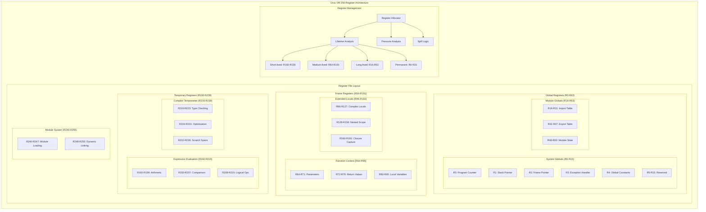
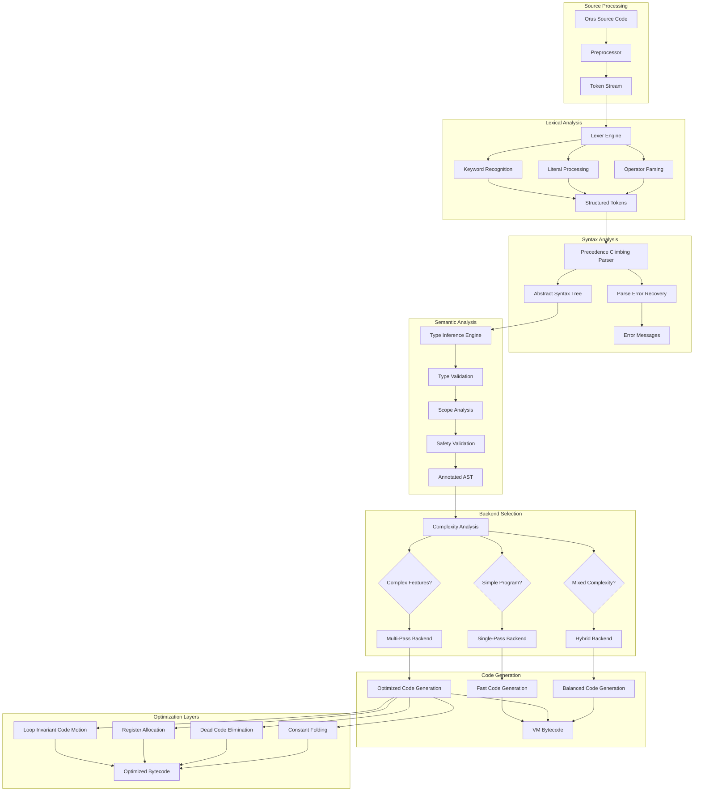
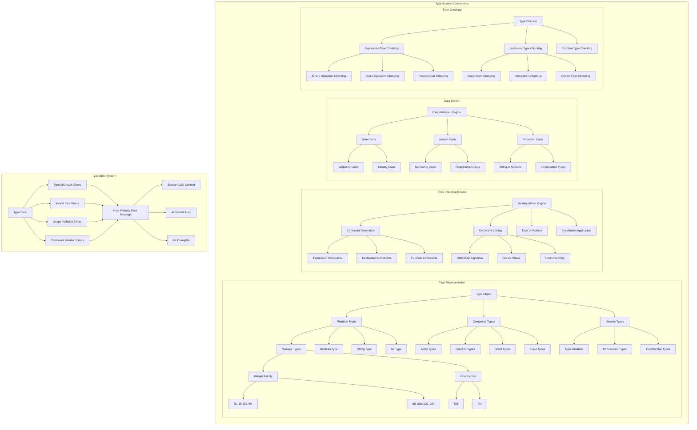
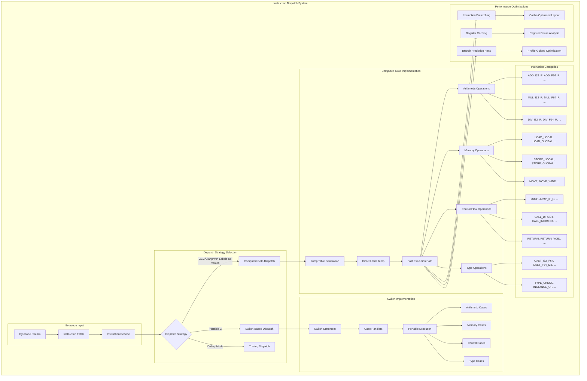
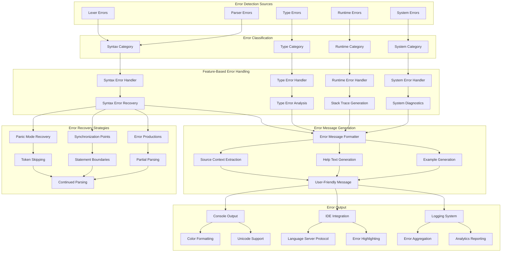

# Orus Architecture Diagrams and Charts

This document contains detailed architectural diagrams and charts for the Orus programming language implementation.

## VM Register Architecture Detailed View



## Compiler Pipeline Detailed Flow



## Type System Architecture



## VM Instruction Dispatch Architecture



## Memory Management Architecture

```mermaid
graph TB
    subgraph "Memory Management System"
        subgraph "Allocation Strategies"
            AllocationRequest[Memory Allocation Request]
            AllocationRequest --> LifetimeAnalysis{Lifetime Analysis}
            
            LifetimeAnalysis --> |Short-lived, Predictable| ArenaAllocation[Arena Allocation]
            LifetimeAnalysis --> |Reusable Objects| ObjectPooling[Object Pooling]
            LifetimeAnalysis --> |General Purpose| HeapAllocation[Heap Allocation]
            LifetimeAnalysis --> |Large Objects| LargeObjectHeap[Large Object Heap]
        end
        
        subgraph "Arena System"
            ArenaAllocation --> TypeArena[Type Object Arena]
            ArenaAllocation --> ASTArena[AST Node Arena]
            ArenaAllocation --> StringArena[String Literal Arena]
            ArenaAllocation --> ConstantArena[Constant Pool Arena]
            
            TypeArena --> BumpAllocator[Bump Pointer Allocator]
            ASTArena --> BumpAllocator
            StringArena --> BumpAllocator
            ConstantArena --> BumpAllocator
            
            BumpAllocator --> FastAllocation[O(1) Allocation]
            BumpAllocator --> BulkDeallocation[Bulk Deallocation]
        end
        
        subgraph "Object Pool System"
            ObjectPooling --> StringPool[String Object Pool]
            ObjectPooling --> ArrayPool[Array Object Pool]
            ObjectPooling --> FunctionPool[Function Object Pool]
            ObjectPooling --> ClosurePool[Closure Object Pool]
            
            StringPool --> FreeList[Free List Management]
            ArrayPool --> FreeList
            FunctionPool --> FreeList
            ClosurePool --> FreeList
            
            FreeList --> ReuseAnalysis[Object Reuse Analysis]
            FreeList --> SizeClassification[Size Classification]
        end
        
        subgraph "Heap Management"
            HeapAllocation --> YoungGeneration[Young Generation]
            HeapAllocation --> OldGeneration[Old Generation]
            HeapAllocation --> PermanentGeneration[Permanent Generation]
            
            YoungGeneration --> MinorGC[Minor GC (Frequent)]
            OldGeneration --> MajorGC[Major GC (Infrequent)]
            PermanentGeneration --> FullGC[Full GC (Rare)]
        end
        
        subgraph "Garbage Collection"
            GCTrigger[GC Trigger]
            GCTrigger --> AllocationThreshold[Allocation Threshold]
            GCTrigger --> MemoryPressure[Memory Pressure]
            GCTrigger --> ExplicitRequest[Explicit GC Request]
            
            GCTrigger --> GCPhases[GC Execution Phases]
            
            GCPhases --> MarkPhase[Mark Phase]
            GCPhases --> SweepPhase[Sweep Phase]
            GCPhases --> CompactPhase[Compact Phase (Optional)]
            
            MarkPhase --> RootScanning[Root Set Scanning]
            MarkPhase --> TransitiveClosure[Transitive Closure]
            
            RootScanning --> StackRoots[Stack References]
            RootScanning --> RegisterRoots[Register References]
            RootScanning --> GlobalRoots[Global References]
            
            SweepPhase --> FreeListUpdate[Free List Update]
            SweepPhase --> MemoryReclamation[Memory Reclamation]
            
            CompactPhase --> PointerUpdate[Pointer Update]
            CompactPhase --> MemoryDefragmentation[Memory Defragmentation]
        end
        
        subgraph "Memory Metrics"
            MemoryMonitoring[Memory Monitoring]
            MemoryMonitoring --> AllocationRate[Allocation Rate Tracking]
            MemoryMonitoring --> GCFrequency[GC Frequency Analysis]
            MemoryMonitoring --> MemoryFragmentation[Fragmentation Metrics]
            MemoryMonitoring --> LifetimeAnalysisMetrics[Object Lifetime Metrics]
            
            AllocationRate --> PerformanceTuning[Performance Tuning]
            GCFrequency --> PerformanceTuning
            MemoryFragmentation --> PerformanceTuning
            LifetimeAnalysisMetrics --> PerformanceTuning
        end
    end
```

## Error Handling System Flow



## Performance Optimization Layers

```mermaid
graph TB
    subgraph "Performance Optimization Stack"
        subgraph "Source Level Optimizations"
            SourceCode[Orus Source Code]
            SourceCode --> ConstantFolding[Constant Folding]
            SourceCode --> DeadCodeElimination[Dead Code Elimination]
            SourceCode --> LoopUnrolling[Loop Unrolling]
            SourceCode --> InlineExpansion[Inline Expansion]
        end
        
        subgraph "AST Level Optimizations"
            ConstantFolding --> ASTOptimizer[AST Optimizer]
            DeadCodeElimination --> ASTOptimizer
            LoopUnrolling --> ASTOptimizer
            InlineExpansion --> ASTOptimizer
            
            ASTOptimizer --> ExpressionSimplification[Expression Simplification]
            ASTOptimizer --> ControlFlowOptimization[Control Flow Optimization]
            ASTOptimizer --> TypeSpecialization[Type Specialization]
        end
        
        subgraph "IR Level Optimizations"
            ExpressionSimplification --> IROptimizer[IR Optimizer]
            ControlFlowOptimization --> IROptimizer
            TypeSpecialization --> IROptimizer
            
            IROptimizer --> LICM[Loop Invariant Code Motion]
            IROptimizer --> CommonSubexpression[Common Subexpression Elimination]
            IROptimizer --> TailCallOptimization[Tail Call Optimization]
            IROptimizer --> RegisterPromotion[Register Promotion]
        end
        
        subgraph "Register Allocation"
            LICM --> RegisterAllocator[Advanced Register Allocator]
            CommonSubexpression --> RegisterAllocator
            TailCallOptimization --> RegisterAllocator
            RegisterPromotion --> RegisterAllocator
            
            RegisterAllocator --> LivenessAnalysis[Liveness Analysis]
            RegisterAllocator --> InterferenceGraph[Interference Graph]
            RegisterAllocator --> ColoringAlgorithm[Graph Coloring]
            RegisterAllocator --> SpillCode[Spill Code Generation]
        end
        
        subgraph "Bytecode Generation"
            LivenessAnalysis --> BytecodeGenerator[Bytecode Generator]
            InterferenceGraph --> BytecodeGenerator
            ColoringAlgorithm --> BytecodeGenerator
            SpillCode --> BytecodeGenerator
            
            BytecodeGenerator --> TypeSpecificOpcodes[Type-Specific Opcodes]
            BytecodeGenerator --> OptimizedInstructions[Optimized Instructions]
            BytecodeGenerator --> EfficientEncoding[Efficient Encoding]
        end
        
        subgraph "VM Runtime Optimizations"
            TypeSpecificOpcodes --> VMOptimizer[VM Runtime Optimizer]
            OptimizedInstructions --> VMOptimizer
            EfficientEncoding --> VMOptimizer
            
            VMOptimizer --> ComputedGoto[Computed Goto Dispatch]
            VMOptimizer --> InstructionPrefetch[Instruction Prefetching]
            VMOptimizer --> RegisterCaching[Register Caching]
            VMOptimizer --> BranchPrediction[Branch Prediction]
        end
        
        subgraph "Hardware Level Optimizations"
            ComputedGoto --> HardwareOptimizer[Hardware Optimizer]
            InstructionPrefetch --> HardwareOptimizer
            RegisterCaching --> HardwareOptimizer
            BranchPrediction --> HardwareOptimizer
            
            HardwareOptimizer --> SIMDInstructions[SIMD Instructions]
            HardwareOptimizer --> CacheOptimization[Cache Optimization]
            HardwareOptimizer --> VectorizationHints[Vectorization Hints]
            HardwareOptimizer --> ArchitectureSpecific[Architecture-Specific Tuning]
        end
    end
    
    subgraph "Performance Monitoring"
        PerformanceProfiler[Performance Profiler]
        PerformanceProfiler --> InstructionCounting[Instruction Counting]
        PerformanceProfiler --> TimingAnalysis[Timing Analysis]
        PerformanceProfiler --> MemoryProfiling[Memory Profiling]
        PerformanceProfiler --> CacheAnalysis[Cache Miss Analysis]
        
        InstructionCounting --> Hotspots[Hotspot Identification]
        TimingAnalysis --> Hotspots
        MemoryProfiling --> Hotspots
        CacheAnalysis --> Hotspots
        
        Hotspots --> OptimizationFeedback[Optimization Feedback Loop]
        OptimizationFeedback --> ProfileGuidedOptimization[Profile-Guided Optimization]
    end
```



## Build System Architecture

```mermaid
graph TB
    subgraph "Build System Components"
        subgraph "Source Management"
            SourceFiles[Source Files (.c, .h)]
            SourceFiles --> DependencyAnalysis[Dependency Analysis]
            DependencyAnalysis --> BuildOrder[Build Order Determination]
            BuildOrder --> IncrementalBuild[Incremental Build Support]
        end
        
        subgraph "Profile Management"
            BuildProfile{Build Profile Selection}
            
            BuildProfile --> DebugProfile[Debug Profile]
            BuildProfile --> ReleaseProfile[Release Profile]
            BuildProfile --> ProfilingProfile[Profiling Profile]
            BuildProfile --> CIProfile[CI Profile]
            
            DebugProfile --> DebugFlags[-O0 -g3 -DDEBUG]
            ReleaseProfile --> ReleaseFlags[-O3 -DNDEBUG -flto]
            ProfilingProfile --> ProfilingFlags[-O2 -g -pg]
            CIProfile --> CIFlags[-O2 -Werror -Wall]
        end
        
        subgraph "Architecture Detection"
            ArchDetection[Architecture Detection]
            ArchDetection --> AppleSilicon[Apple Silicon (M1/M2/M3)]
            ArchDetection --> Intel[Intel x86_64]
            ArchDetection --> ARM[ARM (Linux)]
            ArchDetection --> OtherArch[Other Architectures]
            
            AppleSilicon --> AppleFlags[-mcpu=apple-m1 -mtune=apple-m1]
            Intel --> IntelFlags[-march=native -mtune=native]
            ARM --> ARMFlags[-march=armv8-a]
            OtherArch --> GenericFlags[-march=native]
        end
        
        subgraph "Feature Detection"
            FeatureDetection[Feature Detection]
            FeatureDetection --> ComputedGoto[Computed Goto Support]
            FeatureDetection --> SIMDSupport[SIMD Support]
            FeatureDetection --> LTOSupport[Link-Time Optimization]
            FeatureDetection --> SanitizerSupport[Sanitizer Support]
            
            ComputedGoto --> GotoFlags[-DCOMPUTED_GOTO_DISPATCH]
            SIMDSupport --> SIMDFlags[-DSIMD_OPTIMIZATIONS]
            LTOSupport --> LTOFlags[-flto]
            SanitizerSupport --> SanitizerFlags[-fsanitize=address]
        end
        
        subgraph "Cross-Compilation"
            CrossCompilation[Cross-Compilation Support]
            CrossCompilation --> LinuxTarget[Linux Target]
            CrossCompilation --> WindowsTarget[Windows Target (MinGW)]
            CrossCompilation --> MacOSTarget[macOS Target]
            CrossCompilation --> EmbeddedTarget[Embedded Targets]
            
            LinuxTarget --> LinuxToolchain[Linux Toolchain]
            WindowsTarget --> MinGWToolchain[MinGW Toolchain]
            MacOSTarget --> ClangToolchain[Clang Toolchain]
            EmbeddedTarget --> GCCToolchain[GCC ARM Toolchain]
        end
        
        subgraph "Quality Assurance"
            QualityTools[Quality Assurance Tools]
            QualityTools --> StaticAnalysis[Static Analysis]
            QualityTools --> DynamicAnalysis[Dynamic Analysis]
            QualityTools --> CodeCoverage[Code Coverage]
            QualityTools --> PerformanceTesting[Performance Testing]
            
            StaticAnalysis --> CppCheck[cppcheck]
            StaticAnalysis --> ClangAnalyzer[clang-analyzer]
            StaticAnalysis --> PCLint[PC-Lint Plus]
            
            DynamicAnalysis --> Valgrind[valgrind]
            DynamicAnalysis --> AddressSanitizer[AddressSanitizer]
            DynamicAnalysis --> MemorySanitizer[MemorySanitizer]
            
            CodeCoverage --> GCOV[gcov]
            CodeCoverage --> LLVMCOV[llvm-cov]
            
            PerformanceTesting --> BenchmarkSuite[Benchmark Suite]
            PerformanceTesting --> ProfilingTools[Profiling Tools]
        end
        
        subgraph "Output Generation"
            CompilationOutput[Compilation Output]
            CompilationOutput --> Executable[Orus Interpreter]
            CompilationOutput --> StaticLibrary[Static Library]
            CompilationOutput --> SharedLibrary[Shared Library]
            CompilationOutput --> DebugSymbols[Debug Symbols]
            
            Executable --> ExecutableStripping[Symbol Stripping (Release)]
            StaticLibrary --> LibraryOptimization[Library Optimization]
            SharedLibrary --> SharedLinking[Dynamic Linking]
            DebugSymbols --> SymbolGeneration[Debug Symbol Generation]
        end
    end
    
    subgraph "Build Automation"
        MakefileEngine[Makefile Engine]
        MakefileEngine --> ParallelBuild[Parallel Build Support]
        MakefileEngine --> DependencyTracking[Dependency Tracking]
        MakefileEngine --> ChangeDetection[Change Detection]
        MakefileEngine --> CacheManagement[Build Cache Management]
        
        ParallelBuild --> CPUUtilization[CPU Utilization Optimization]
        DependencyTracking --> MinimalRebuild[Minimal Rebuild]
        ChangeDetection --> TimestampComparison[Timestamp Comparison]
        CacheManagement --> BuildArtifacts[Build Artifact Caching]
    end
```

These architectural diagrams provide comprehensive visual documentation of the Orus programming language implementation, covering all major subsystems in detail.