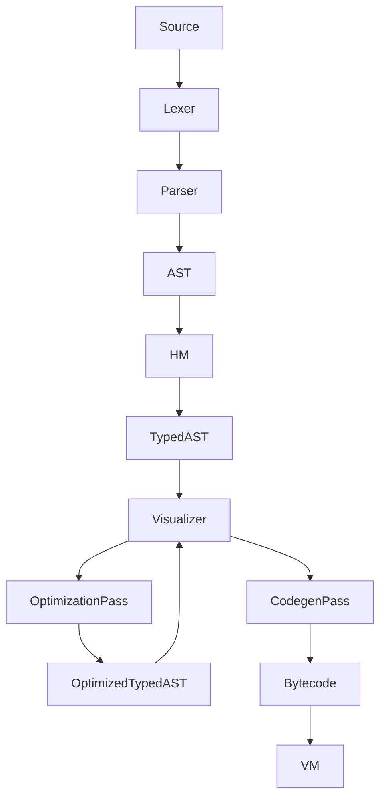

# Orus Compiler Design Specification
## A Simple, Efficient Compiler for the Orus Register-Based VM with Hindley-Milner Type System

### Executive Summary
This document outlines the design for the multi-pass Orus compiler that transforms a typed Abstract Syntax Tree (AST), generated by Hindley-Milner (HM) type inference, into bytecode for the 256-register virtual machine (VM). The typed AST is the central data structure that feeds optimization and code generation passes, replacing the limitations of an older single-pass prototype that coupled HM inference and emission. A dedicated visualization tool (`typed_ast_visualizer.c`) supports debugging by printing the typed AST after each pass. The current implementation focuses on predictable compilation, a maintainable backend pipeline, and clear observability hooks so that new optimizations can be introduced incrementally.

### Table of Contents
- Architecture Overview
- Design Principles
- Component Analysis
- Compiler Pipeline
- Typed AST Visualization
- Register Allocation Strategy
- Bytecode Generation
- Type System Integration
- Optimization Passes
- Implementation Status and Roadmap
- Testing Strategy
- Performance Expectations
- Error Handling Integration
- File Structure
- Success Criteria
- Conclusion

### Architecture Overview

#### Current State Analysis
- **Existing Components**:
  - ✅ **Lexer**: Comprehensive tokenization with 105+ token types, including type suffixes (e.g., 42i32), strings, and indentation tracking.
  - ✅ **Parser**: Precedence-climbing parser producing a rich AST with all language constructs.
  - ✅ **VM**: 256-register VM with 135+ opcodes, supporting type-specific operations and efficient dispatch.
  - ✅ **HM Type System**: Phase 5 complete, with comprehensive type inference and casting support, producing a typed AST.
  - ✅ **Compiler Backend**: Multi-pass pipeline implemented with constant folding, register allocation, bytecode emission, and visualization hooks.

#### Target Architecture
The compiler processes the typed AST through multiple passes—optimization and code generation—to produce optimized bytecode. A visualization tool aids debugging by outputting the typed AST structure after key passes. The process is illustrated below:


#### Integration Points
- **Input**: Typed AST from `type_inference.c`, where HM type inference annotates each node with types (e.g., i32, f64).
- **Output**: Optimized bytecode arrays for VM execution, stored in a `BytecodeBuffer`.
- **Type System**: `type_representation.c` for accessing type information and validating casts.
- **Error Reporting**: Modular error system in `src/errors/features/` for detailed, actionable messages.
- **Visualization**: `typed_ast_visualizer.c` for debugging the typed AST after each pass.

### Design Principles
1. **Simplicity**
   - Multi-pass compilation separates concerns (optimization, codegen) while minimizing complexity per pass.
   - Avoids excessive intermediate representations beyond the typed AST.
   - Visualization simplifies debugging across passes.

2. **Performance**
   - Focuses on predictable compile times across passes.
   - Leverages type-specific opcodes (e.g., `ADD_I32_R`) for runtime efficiency.
   - Optimizes register usage in the 256-register VM to minimize spills.

3. **Safety**
   - Uses HM-inferred types in the typed AST for compile-time type safety.
   - Provides clear, actionable error messages for type mismatches and invalid casts.
   - Visualization ensures type correctness after each pass.

### Component Analysis

#### Lexer Capabilities (`src/compiler/frontend/lexer.c`)
- **Strengths**: Supports 105+ token types, including literals (42i32, "hello"), operators, and keywords. Efficient keyword lookup and indentation tracking for Orus' significant-whitespace syntax.
- **Integration Notes**: Produces tokens for the parser, which builds the AST consumed by HM type inference.

#### Parser Capabilities (`src/compiler/frontend/parser.c`)
- **Strengths**: Generates a complete AST supporting all Orus constructs (variables, functions, control flow).
- **AST Node Coverage**:
  - `NODE_PROGRAM`, `NODE_VAR_DECL`, `NODE_IDENTIFIER`, `NODE_LITERAL`
  - `NODE_BINARY`, `NODE_ASSIGN`, `NODE_PRINT`, `NODE_CAST`
  - `NODE_IF`, `NODE_WHILE`, `NODE_FOR_RANGE`, `NODE_BLOCK`
  - `NODE_FUNCTION`, `NODE_CALL`, `NODE_RETURN`

#### VM Target (`include/vm/vm.h`)
- **Capabilities**: 256 registers (R0-R255) with specialized ranges, 135+ opcodes covering arithmetic, memory, control flow, and type operations.
- **Register Layout**:
  - R0-R63: Global registers (long-lived variables)
  - R64-R191: Frame registers (function locals, parameters)
  - R192-R239: Temporary registers (expression evaluation)
  - R240-R255: Module registers (imports/exports)
- **Key Instruction Categories**:
  - Arithmetic: `ADD_I32_R`, `MUL_F64_R`, etc.
  - Memory: `LOAD_CONST_I32`, `STORE_LOCAL`, etc.
  - Control Flow: `JUMP_IF_R`, `CALL_DIRECT`, etc.
  - Type Operations: `CAST_I32_STR`, `TYPE_CHECK`, etc.

### Compiler Pipeline

#### Multi-Pass Design
The compiler processes the typed AST through two main passes: an optimization pass to enhance code quality and a code generation pass to emit bytecode. This resolves the limitations of the previous single-pass attempt, which struggled with combined HM inference and codegen complexity.

- **Typed AST Generation**:
  - **HM Type Inference**: Implemented in `type_inference.c`, this phase traverses the raw AST to resolve types using HM unification. Each node is annotated with its type (e.g., `x: i32` for `x = 42`), producing a typed AST.
  - **Process**: Collects type constraints (e.g., `x + 24` implies `x: i32`), unifies them, and assigns concrete types. Handles polymorphism, explicit type annotations (e.g., 42i32), and casts (via `as`).
  - **Output**: A typed AST where each node includes a `dataType` field (e.g., `TYPE_I32`, `TYPE_F64`), enabling subsequent passes.

- **Optimization Pass**:
  - Traverses the typed AST to apply constant folding and algebraic simplifications.
  - Output: An optimized typed AST.

- **Code Generation Pass**:
  - Traverses the optimized typed AST to emit bytecode into a `BytecodeBuffer`.
  - Uses pre-inferred and optimized types to select opcodes and allocate registers.

- **Pipeline**:
  ```mermaid
  flowchart TB
    Source --> Lexer --> Parser --> AST
    AST --> HM --> TypedAST
    TypedAST --> Visualizer --> OptimizationPass --> OptimizedTypedAST
    OptimizedTypedAST --> Visualizer --> CodegenPass --> Bytecode
    Bytecode --> VM
  ```

- **Example**:
  - Input: `x = 42; y = x + 24`
  - **HM Type Inference**: Produces typed AST: `x: i32 = 42`, `y: i32 = x + 24`.
  - **Optimization Pass**: Folds constants and simplifies algebraic patterns when possible.
  - **Code Generation Pass**:
    - `x = 42`: Allocate R0, emit `LOAD_CONST_I32 R0, 42`.
    - `y = x + 24`: Allocate R1, R192, emit `LOAD_CONST_I32 R192, 24; ADD_I32_R R1, R0, R192`.
  - All bytecode generated after optimization.

#### Compilation Context
`include/compiler/compiler.h` defines `CompilerContext`, which consolidates every subsystem required during compilation:
- **Typed AST Handles**: `input_ast` and `optimized_ast` track the HM output and the in-place optimized tree.
- **Register Allocation**: A dual allocator facade maintains global, local, and temporary register pointers (`next_global_register`, `next_local_register`, `next_temp_register`).
- **Symbol and Scope Tracking**: `SymbolTable` and `ScopeStack` references keep bindings synchronized with register assignments.
- **Bytecode Output**: `BytecodeBuffer*` and `ConstantPool*` manage emitted instructions and literal storage. Function-specific chunks are collected in `function_chunks` alongside arities.
- **Diagnostics**: `ErrorReporter*`, `has_compilation_errors`, and visualization flags (`enable_visualization`, `dump_bytecode`) control reporting and debugging output.
- **Optimization State**: `OptimizationContext* opt_ctx` stores registered passes and accumulated statistics.
- **Control-Flow Metadata**: Loop offsets, branch depth, and arrays of break/continue patch locations allow structured constructs to be assembled and fixed up after emission.

### Typed AST Visualization
A visualization tool (`typed_ast_visualizer.c`) outputs the typed AST in a tree-like format after HM type inference and the optimization pass, aiding debugging.
- **Purpose**: Debug HM output, validate optimizations, and verify node types/structure.
- **Implementation**:
  - **File**: `src/compiler/backend/typed_ast_visualizer.c`
  - **Function**: `visualize_typed_ast(CompilerContext* ctx, FILE* output)`
  - **Output Format**: Indented tree with node types, identifiers, and type annotations (e.g., `NODE_VAR_DECL: x, type=i32`).
  - **Usage**: Invoked via `--visualize-ast` after each pass, outputting to console or file (e.g., `typed_ast.txt`).
- **Example Visualization**:
  - Input: `x = 42; y = x + 24`
  - Output:
    ```
    Program
      VarDecl: x, type=i32
        Literal: 42, type=i32
      VarDecl: y, type=i32
        Binary: +, type=i32
          Identifier: x, type=i32
          Literal: 24, type=i32
    ```

### Register Allocation Strategy

#### Register Assignment Strategy
- **Global Variables (R0-R63)**: Assigned at compile time for module-level variables, tracked in the `SymbolTable`.
- **Function Frame (R64-R191)**: Parameters (R64-R79) and locals (R80-R191) allocated based on declaration order within function scopes.
- **Temporaries (R192-R239)**: Stack-based allocation with reuse for expression evaluation, managed by `next_temp_register`.

#### Example Register Allocation
- `x = 42` // Global: R0
- `y = x + 24` // Global: R1, Temp: R192 for intermediate
- `fn foo(a, b) { c = a + b; return c }` // Params: R64, R65; Local: R80, Temp: R192
- Generated Register Usage:
  - `LOAD_CONST_I32 R0, 42`
  - `LOAD_CONST_I32 R192, 24; ADD_I32_R R1, R0, R192`
  - `ADD_I32_R R192, R64, R65; MOVE R80, R192; RETURN R80`

### Bytecode Generation

#### Compilation Strategies by Node Type
- **Variable Declarations (NODE_VAR_DECL)**:
  ```c
  void compile_var_decl(CompilerContext* ctx, TypedASTNode* node) {
      int value_reg = compile_expression(ctx, node->varDecl.initializer);
      int var_reg = allocate_variable_register(ctx, node->varDecl.name);
      emit_instruction(ctx, OP_MOVE, var_reg, value_reg, 0);
      register_symbol(ctx, node->varDecl.name, var_reg, node->dataType);
  }
  ```

- **Binary Expressions (NODE_BINARY)**:
  ```c
  int compile_binary(CompilerContext* ctx, TypedASTNode* node) {
      int left_reg = compile_expression(ctx, node->binary.left);
      int right_reg = compile_expression(ctx, node->binary.right);
      int result_reg = allocate_temp_register(ctx);
      Opcode op = select_arithmetic_opcode(node->binary.op, node->dataType);
      emit_instruction(ctx, op, result_reg, left_reg, right_reg);
      return result_reg;
  }
  ```

- **Type Casting (NODE_CAST) using `as` keyword**:
  ```c
  int compile_cast(CompilerContext* ctx, TypedASTNode* node) {
      int src_reg = compile_expression(ctx, node->cast.expression);
      int dst_reg = allocate_temp_register(ctx);
      if (!can_cast(node->cast.fromType, node->cast.toType)) {
          report_invalid_cast_target(ctx->errors, node->location, node->cast.fromType, node->cast.toType);
          return -1;
      }
      Opcode cast_op = get_cast_opcode(node->cast.fromType, node->cast.toType);
      emit_instruction(ctx, cast_op, dst_reg, src_reg, 0);
      return dst_reg;
  }
  ```

#### Instruction Selection
- **Type-Specific Operations**:
  ```c
  Opcode select_arithmetic_opcode(const char* op, Type* type) {
      if (strcmp(op, "+") == 0) {
          switch (type->kind) {
              case TYPE_I32: return OP_ADD_I32_TYPED;
              case TYPE_F64: return OP_ADD_F64_R;
              case TYPE_STRING: return OP_STRING_CONCAT;
              default: return OP_INVALID;
          }
      }
      // Similar for -, *, /, etc.
  }
  ```

### Type System Integration

#### Type Checking During Compilation
- **Type Inference**: `type_inference.c` resolves types for all expressions and variables, annotating nodes with `dataType`.
- **Type Validation**: Uses `node->dataType` to ensure binary operation compatibility.
- **Cast Insertion**: Emits cast instructions (e.g., `CAST_I32_F64`) for valid `as` conversions.
- **Error Reporting**: Reports type mismatches via `type_errors.c` with structured diagnostics.

#### Cast Rules Implementation
```c
bool can_cast(Type* from, Type* to) {
    if (is_numeric(from) && is_numeric(to)) return true;  // e.g., i32 -> f64
    if (from->kind == TYPE_BOOL && is_numeric(to)) return true;  // bool -> i32
    if (is_numeric(from) && to->kind == TYPE_BOOL) return true;  // i32 -> bool
    if (to->kind == TYPE_STRING) return true;  // Most types to string
    if (from->kind == TYPE_STRING) return false;  // String to others disallowed
    return false;
}
```

### Optimization Passes

#### Typed AST Optimizations (Implemented)
1. **Constant Folding**:
   - Performed by `optimization/constantfold.c` during the optimization pass.
   - Replaces expressions such as `2 + 3` with literal `5`, applies boolean algebra simplifications, and updates typed nodes in place.

2. **Algebraic Simplification**:
   - Simplifies operations like `expr * 0`, `expr and false`, or `expr or true` when the operands are literals.
   - Shares infrastructure with the constant folding visitor and contributes to the same optimization counters.

#### Bytecode Peephole Optimizations (Implemented)
- `codegen/peephole.c` runs after bytecode emission to fuse `LOAD`+`MOVE` patterns, eliminate redundant moves, and drop repeated constant loads.
- The pass tracks statistics (patterns optimized, instructions eliminated) to make effects observable during debugging sessions.

#### Planned Enhancements
- **Dead Code Elimination** and **Common Subexpression Elimination**: Registration stubs exist in `optimization/optimizer.c` but are currently disabled until supporting analysis is complete.
- **Loop-Invariant Code Motion** and **Jump Threading**: Identified as future work that will build on liveness data and control-flow analysis once those utilities land in the backend.
- **Interprocedural Optimization**: Reserved for later phases to inline small functions and share constants across modules once the module system exposes the necessary metadata.

#### Optimization Context
```c
typedef struct OptimizationContext {
    OptimizationPass* passes;   // Ordered list of registered passes
    size_t pass_count;          // Active pass count
    size_t pass_capacity;       // Allocated pass slots
    ConstantTable* constants;   // Reserved for future constant tables
    UsageAnalysis* usage;       // Placeholder for liveness data
    ExpressionCache* expressions; // Planned expression cache
    int optimizations_applied;
    int nodes_eliminated;
    int constants_folded;
    int binary_expressions_folded;
    bool verbose_output;
} OptimizationContext;
```

### Implementation Status and Roadmap

#### Completed Milestones
- **Core Infrastructure**: `compiler/backend/compiler.c` orchestrates the pipeline, `register_allocator.c` manages the 256-register layout, and `typed_ast_visualizer.c` exposes inspection hooks.
- **Optimization Pass Wiring**: `optimization/optimizer.c` registers constant folding and exposes toggles for future passes.
- **Expression and Statement Codegen**: `codegen/expressions.c` and `codegen/statements.c` cover literals, assignments, control flow, and pattern-specific emission helpers.
- **Function and Module Support**: `codegen/functions.c` and `codegen/modules.c` coordinate function frames, exports, and module-aware register reservations.
- **Peephole Optimizations**: `codegen/peephole.c` runs after emission to reduce redundant instructions and fuse simple patterns.

#### Upcoming Work
- **Additional Typed AST Passes**: Flesh out dead code elimination, common subexpression elimination, and loop-aware transformations once supporting analysis utilities are ready.
- **Register Allocation Enhancements**: Integrate liveness data to improve temporary reuse and spill avoidance beyond the current sequential allocator.
- **Bytecode Optimization Expansion**: Extend peephole pattern coverage and add verification helpers that ensure optimizations preserve semantics.
- **Benchmark Automation**: Capture compile-time and runtime metrics in CI to monitor trends as new passes are added.

### Testing Strategy

#### Unit Tests
```c
// test_typed_ast_visualizer.c
void test_visualize_var_decl() {
    TypedASTNode* node = create_var_decl_node("x", create_literal_node(42, TYPE_I32));
    CompilerContext ctx = init_compiler_context();
    FILE* output = tmpfile();
    visualize_typed_ast(&ctx, output);
    // Verify output contains "VarDecl: x, type=i32"
}
```

#### Integration Tests
```c
// tests/compiler/basic_arithmetic.orus
x = 42
y = 24
result = x + y
print(result)
// Expected visualization (post-optimization):
// Program
//   VarDecl: x, type=i32
//     Literal: 42, type=i32
//   VarDecl: y, type=i32
//     Literal: 24, type=i32
//   VarDecl: result, type=i32
//     Binary: +, type=i32
//       Identifier: x, type=i32
//       Literal: 24, type=i32
// Expected bytecode:
LOAD_CONST_I32 R0, 42
LOAD_CONST_I32 R1, 24
ADD_I32_R R2, R0, R1
CALL_DIRECT R192, print, R2
```

#### Regression Tests
- Verify existing test cases pass with new multi-pass compiler and visualizer.
- Track compilation throughput and runtime benchmarks to detect regressions.

### Performance Expectations

#### Compilation Speed
- **Target**: Sustain high throughput (>10,000 lines/second across all passes) as the backend matures.
- **Measurement**: Time from typed AST to bytecode, including optimization.
- **Tracking**: Record throughput in benchmarks to monitor regressions.

#### Generated Code Quality
- **Register Efficiency**: <5% spill rate with optimizations.
- **Instruction Count**: 10–20% reduction via constant folding and dead code elimination.
- **Runtime Performance**: Measure execution time of representative programs and aim for continual improvement.

### Error Handling Integration

#### Compiler Error Categories
```c
// src/errors/features/compiler_errors.c
void report_register_exhaustion(SourceLocation loc, const char* func);
void report_type_mismatch_binary(SourceLocation loc, const char* op, Type* left, Type* right);
void report_invalid_cast_target(SourceLocation loc, Type* from, Type* to);
void report_undefined_variable(SourceLocation loc, const char* name);
```

### File Structure
```
src/compiler/
├── backend/
│   ├── compiler.c                 // Pipeline coordinator
│   ├── codegen/
│   │   ├── codegen.c              // Entry point for emission
│   │   ├── expressions.c          // Expression emission helpers
│   │   ├── functions.c            // Function prologue/epilogue handling
│   │   ├── modules.c              // Module import/export handling
│   │   ├── peephole.c             // Bytecode peephole optimizations
│   │   └── statements.c           // Statement emission helpers
│   ├── optimization/
│   │   ├── constantfold.c         // Constant folding visitor
│   │   └── optimizer.c            // Pass registration and driver
│   ├── register_allocator.c       // Register management
│   ├── scope_stack.c              // Lexical scope stack implementation
│   └── typed_ast_visualizer.c     // Typed AST visualization
├── frontend/
│   ├── lexer.c                // ✅ Already implemented
│   └── parser.c               // ✅ Already implemented
include/compiler/
├── compiler.h                 // Compiler interface
├── codegen/                   // Code generation headers
│   ├── codegen.h              // Code generation pass API
│   ├── expressions.h          // Expression helpers
│   ├── functions.h            // Function helpers
│   ├── modules.h              // Module helpers
│   ├── peephole.h             // Peephole optimizer API
│   └── statements.h           // Statement helpers
├── optimization/              // Optimization headers
│   ├── constantfold.h
│   └── optimizer.h
├── register_allocator.h       // Register allocation API
├── scope_stack.h              // Scope stack API
└── typed_ast_visualizer.h     // Visualization API
```

### Success Criteria

#### Functional Requirements
- Compile all existing test cases successfully.
- Generate optimized bytecode for VM execution.
- Produce and visualize typed AST with HM type system after each pass.
- Provide clear, context-rich error messages.
- Support all AST node types with optimizations.

#### Performance Requirements
- Compilation speed: >10,000 lines/second across passes.
- Register efficiency: <5% spill rate.
- Code quality: Continually improve runtime performance across benchmarks.
- Memory usage: <1MB for typical programs.

#### Quality Requirements
- Zero runtime errors for valid programs.
- Clear error messages for invalid programs.
- 100% test coverage for compiler, optimizer, and visualizer components.
- Comprehensive documentation and examples.

### Conclusion
The Orus compiler achieves its goals by adopting a multi-pass design that decouples HM type inference, optimization, and code generation into distinct phases. The typed AST, enhanced by a visualization tool (`typed_ast_visualizer.c`) after each pass, keeps debugging and validation straightforward. This design overcomes the complexity of the previous single-pass attempt and establishes a foundation for predictable performance improvements as additional optimizations are implemented.

---

### Key Changes
1. **Architecture Overview**: Documents the now-implemented multi-pass pipeline that connects optimization, register allocation, and code generation.
2. **Compiler Pipeline**: Updates the flow description to match the current orchestration in `compiler/backend/compiler.c`.
3. **Optimization Passes**: Clarifies that constant folding is active today and outlines how additional passes will integrate when implemented.
4. **Performance Expectations**: Focuses on tracking throughput and benchmark trends instead of comparisons to other languages.
5. **Success Criteria**: Emphasizes diagnostic quality and maintainable performance improvements.
