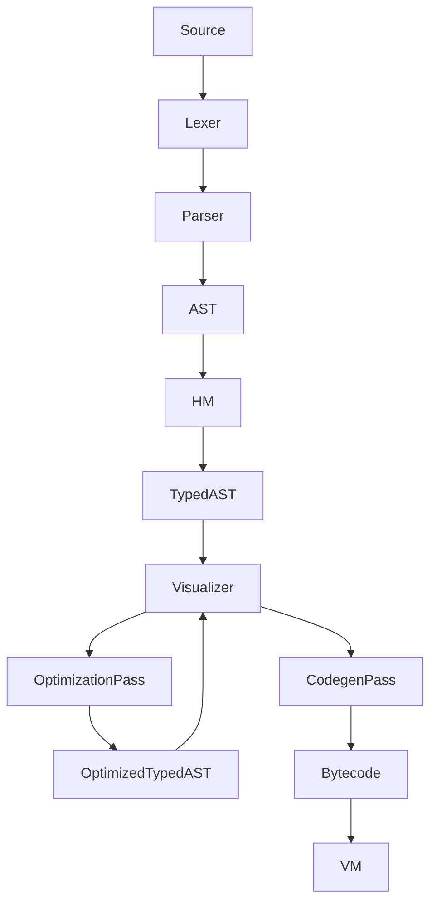

# Orus Compiler Design Specification
## A Simple, Efficient Compiler for the Orus Register-Based VM with Hindley-Milner Type System

### Executive Summary
This document outlines the design for a multi-pass compiler that transforms a typed Abstract Syntax Tree (AST), generated by Hindley-Milner (HM) type inference, into optimized bytecode for a 256-register virtual machine (VM). The typed AST, a critical component, provides pre-resolved type information to support multiple optimization passes, addressing the limitations of a previous single-pass attempt that combined HM inference and code generation. A dedicated visualization tool (`typed_ast_visualizer.c`) aids debugging by inspecting the typed AST after each pass. The design delivers Python-like readability, Rust-like safety, and Lua-like performance, targeting >10,000 lines/second compilation and runtime performance 10x Python and 12x JavaScript.

### Table of Contents
- Architecture Overview
- Design Principles
- Component Analysis
- Compiler Pipeline
- Typed AST Visualization
- Register Allocation Strategy
- Bytecode Generation
- Type System Integration
- Optimization Passes
- Implementation Plan
- Testing Strategy
- Performance Expectations
- Error Handling Integration
- File Structure
- Success Criteria
- Conclusion

### Architecture Overview

#### Current State Analysis
- **Existing Components**:
  - ✅ **Lexer**: Comprehensive tokenization with 105+ token types, including type suffixes (e.g., 42i32), strings, and indentation tracking.
  - ✅ **Parser**: Precedence-climbing parser producing a rich AST with all language constructs.
  - ✅ **VM**: 256-register VM with 135+ opcodes, supporting type-specific operations and efficient dispatch.
  - ✅ **HM Type System**: Phase 5 complete, with comprehensive type inference and casting support, producing a typed AST.
  - ❌ **Compiler**: Missing - this is the implementation target.

#### Target Architecture
The compiler processes the typed AST through multiple passes—optimization and code generation—to produce optimized bytecode. A visualization tool aids debugging by outputting the typed AST structure after key passes. The process is illustrated below:


#### Integration Points
- **Input**: Typed AST from `type_inference.c`, where HM type inference annotates each node with types (e.g., i32, f64).
- **Output**: Optimized bytecode arrays for VM execution, stored in a `BytecodeBuffer`.
- **Type System**: `type_representation.c` for accessing type information and validating casts.
- **Error Reporting**: Modular error system in `src/errors/features/` for Rust-like error messages.
- **Visualization**: `typed_ast_visualizer.c` for debugging the typed AST after each pass.

### Design Principles
1. **Simplicity (Lua-Inspired)**  
   - Multi-pass compilation separates concerns (optimization, codegen) while minimizing complexity per pass.
   - Avoids excessive intermediate representations beyond the typed AST.
   - Visualization simplifies debugging across passes.

2. **Performance (Lua-Like)**  
   - Targets >10,000 lines/second compilation speed across passes.
   - Leverages type-specific opcodes (e.g., `ADD_I32_R`) for runtime efficiency.
   - Optimizes register usage in the 256-register VM to minimize spills.

3. **Safety (Rust-Like)**  
   - Uses HM-inferred types in the typed AST for compile-time type safety.
   - Provides clear, actionable error messages for type mismatches and invalid casts.
   - Visualization ensures type correctness after each pass.

### Component Analysis

#### Lexer Capabilities (`src/compiler/frontend/lexer.c`)
- **Strengths**: Supports 105+ token types, including literals (42i32, "hello"), operators, and keywords. Efficient keyword lookup and indentation tracking for Python-like syntax.
- **Integration Notes**: Produces tokens for the parser, which builds the AST consumed by HM type inference.

#### Parser Capabilities (`src/compiler/frontend/parser.c`)
- **Strengths**: Generates a complete AST supporting all Orus constructs (variables, functions, control flow).
- **AST Node Coverage**:
  - `NODE_PROGRAM`, `NODE_VAR_DECL`, `NODE_IDENTIFIER`, `NODE_LITERAL`
  - `NODE_BINARY`, `NODE_ASSIGN`, `NODE_PRINT`, `NODE_CAST`
  - `NODE_IF`, `NODE_WHILE`, `NODE_FOR_RANGE`, `NODE_BLOCK`
  - `NODE_FUNCTION`, `NODE_CALL`, `NODE_RETURN`

#### VM Target (`include/vm/vm.h`)
- **Capabilities**: 256 registers (R0-R255) with specialized ranges, 135+ opcodes covering arithmetic, memory, control flow, and type operations.
- **Register Layout**:
  - R0-R63: Global registers (long-lived variables)
  - R64-R191: Frame registers (function locals, parameters)
  - R192-R239: Temporary registers (expression evaluation)
  - R240-R255: Module registers (imports/exports)
- **Key Instruction Categories**:
  - Arithmetic: `ADD_I32_R`, `MUL_F64_R`, etc.
  - Memory: `LOAD_CONST_I32`, `STORE_LOCAL`, etc.
  - Control Flow: `JUMP_IF_R`, `CALL_DIRECT`, etc.
  - Type Operations: `CAST_I32_STR`, `TYPE_CHECK`, etc.

### Compiler Pipeline

#### Multi-Pass Design
The compiler processes the typed AST through two main passes: an optimization pass to enhance code quality and a code generation pass to emit bytecode. This resolves the limitations of the previous single-pass attempt, which struggled with combined HM inference and codegen complexity.

- **Typed AST Generation**:
  - **HM Type Inference**: Implemented in `type_inference.c`, this phase traverses the raw AST to resolve types using HM unification. Each node is annotated with its type (e.g., `x: i32` for `x = 42`), producing a typed AST.
  - **Process**: Collects type constraints (e.g., `x + 24` implies `x: i32`), unifies them, and assigns concrete types. Handles polymorphism, explicit type annotations (e.g., 42i32), and casts (via `as`).
  - **Output**: A typed AST where each node includes a `dataType` field (e.g., `TYPE_I32`, `TYPE_F64`), enabling subsequent passes.

- **Optimization Pass**:
  - Traverses the typed AST to apply optimizations (e.g., LCIM, constant folding).
  - Output: An optimized typed AST.

- **Code Generation Pass**:
  - Traverses the optimized typed AST to emit bytecode into a `BytecodeBuffer`.
  - Uses pre-inferred and optimized types to select opcodes and allocate registers.

- **Pipeline**:
  ```mermaid
  flowchart TB
    Source --> Lexer --> Parser --> AST
    AST --> HM --> TypedAST
    TypedAST --> Visualizer --> OptimizationPass --> OptimizedTypedAST
    OptimizedTypedAST --> Visualizer --> CodegenPass --> Bytecode
    Bytecode --> VM
  ```

- **Example**:
  - Input: `x = 42; y = x + 24`
  - **HM Type Inference**: Produces typed AST: `x: i32 = 42`, `y: i32 = x + 24`.
  - **Optimization Pass**: Folds constants if present, hoists loop invariants if applicable.
  - **Code Generation Pass**:
    - `x = 42`: Allocate R0, emit `LOAD_CONST_I32 R0, 42`.
    - `y = x + 24`: Allocate R1, R192, emit `LOAD_CONST_I32 R192, 24; ADD_I32_R R1, R0, R192`.
  - All bytecode generated after optimization.

#### Compilation Context
```c
typedef struct CompilerContext {
    TypedASTNode* typed_ast;       // Input from type inference
    RegisterAllocator allocator;   // Manages 256 registers
    int next_temp_register;        // Tracks R192-R239
    int next_local_register;       // Tracks R64-R191
    SymbolTable* symbols;          // Maps variables to registers and types
    ScopeStack* scopes;            // Manages lexical scoping
    BytecodeBuffer bytecode;       // Output buffer for bytecode
    ConstantPool constants;        // Stores constants (e.g., 42, "hello")
    ErrorReporter* errors;         // For Rust-like error reporting
    OptimizationContext* opt_ctx;  // For optimization pass state
} CompilerContext;
```

### Typed AST Visualization
A visualization tool (`typed_ast_visualizer.c`) outputs the typed AST in a tree-like format after HM type inference and the optimization pass, aiding debugging.
- **Purpose**: Debug HM output, validate optimizations, and verify node types/structure.
- **Implementation**:
  - **File**: `src/compiler/backend/typed_ast_visualizer.c`
  - **Function**: `visualize_typed_ast(CompilerContext* ctx, FILE* output)`
  - **Output Format**: Indented tree with node types, identifiers, and type annotations (e.g., `NODE_VAR_DECL: x, type=i32`).
  - **Usage**: Invoked via `--visualize-ast` after each pass, outputting to console or file (e.g., `typed_ast.txt`).
- **Example Visualization**:
  - Input: `x = 42; y = x + 24`
  - Output:
    ```
    Program
      VarDecl: x, type=i32
        Literal: 42, type=i32
      VarDecl: y, type=i32
        Binary: +, type=i32
          Identifier: x, type=i32
          Literal: 24, type=i32
    ```

### Register Allocation Strategy

#### Register Assignment Strategy
- **Global Variables (R0-R63)**: Assigned at compile time for module-level variables, tracked in the `SymbolTable`.
- **Function Frame (R64-R191)**: Parameters (R64-R79) and locals (R80-R191) allocated based on declaration order within function scopes.
- **Temporaries (R192-R239)**: Stack-based allocation with reuse for expression evaluation, managed by `next_temp_register`.

#### Example Register Allocation
- `x = 42` // Global: R0
- `y = x + 24` // Global: R1, Temp: R192 for intermediate
- `fn foo(a, b) { c = a + b; return c }` // Params: R64, R65; Local: R80, Temp: R192
- Generated Register Usage:
  - `LOAD_CONST_I32 R0, 42`
  - `LOAD_CONST_I32 R192, 24; ADD_I32_R R1, R0, R192`
  - `ADD_I32_R R192, R64, R65; MOVE R80, R192; RETURN R80`

### Bytecode Generation

#### Compilation Strategies by Node Type
- **Variable Declarations (NODE_VAR_DECL)**:
  ```c
  void compile_var_decl(CompilerContext* ctx, TypedASTNode* node) {
      int value_reg = compile_expression(ctx, node->varDecl.initializer);
      int var_reg = allocate_variable_register(ctx, node->varDecl.name);
      emit_instruction(ctx, OP_MOVE, var_reg, value_reg, 0);
      register_symbol(ctx, node->varDecl.name, var_reg, node->dataType);
  }
  ```

- **Binary Expressions (NODE_BINARY)**:
  ```c
  int compile_binary(CompilerContext* ctx, TypedASTNode* node) {
      int left_reg = compile_expression(ctx, node->binary.left);
      int right_reg = compile_expression(ctx, node->binary.right);
      int result_reg = allocate_temp_register(ctx);
      Opcode op = select_arithmetic_opcode(node->binary.op, node->dataType);
      emit_instruction(ctx, op, result_reg, left_reg, right_reg);
      return result_reg;
  }
  ```

- **Type Casting (NODE_CAST) using `as` keyword**:
  ```c
  int compile_cast(CompilerContext* ctx, TypedASTNode* node) {
      int src_reg = compile_expression(ctx, node->cast.expression);
      int dst_reg = allocate_temp_register(ctx);
      if (!can_cast(node->cast.fromType, node->cast.toType)) {
          report_invalid_cast_target(ctx->errors, node->location, node->cast.fromType, node->cast.toType);
          return -1;
      }
      Opcode cast_op = get_cast_opcode(node->cast.fromType, node->cast.toType);
      emit_instruction(ctx, cast_op, dst_reg, src_reg, 0);
      return dst_reg;
  }
  ```

#### Instruction Selection
- **Type-Specific Operations**:
  ```c
  Opcode select_arithmetic_opcode(const char* op, Type* type) {
      if (strcmp(op, "+") == 0) {
          switch (type->kind) {
              case TYPE_I32: return OP_ADD_I32_TYPED;
              case TYPE_F64: return OP_ADD_F64_R;
              case TYPE_STRING: return OP_STRING_CONCAT;
              default: return OP_INVALID;
          }
      }
      // Similar for -, *, /, etc.
  }
  ```

### Type System Integration

#### Type Checking During Compilation
- **Type Inference**: `type_inference.c` resolves types for all expressions and variables, annotating nodes with `dataType`.
- **Type Validation**: Uses `node->dataType` to ensure binary operation compatibility.
- **Cast Insertion**: Emits cast instructions (e.g., `CAST_I32_F64`) for valid `as` conversions.
- **Error Reporting**: Reports type mismatches via `type_errors.c` with Rust-like messages.

#### Cast Rules Implementation
```c
bool can_cast(Type* from, Type* to) {
    if (is_numeric(from) && is_numeric(to)) return true;  // e.g., i32 -> f64
    if (from->kind == TYPE_BOOL && is_numeric(to)) return true;  // bool -> i32
    if (is_numeric(from) && to->kind == TYPE_BOOL) return true;  // i32 -> bool
    if (to->kind == TYPE_STRING) return true;  // Most types to string
    if (from->kind == TYPE_STRING) return false;  // String to others disallowed
    return false;
}
```

### Optimization Passes

#### Local Optimizations
1. **Constant Folding**:
   - Replaces `2 + 3` with `5` in the typed AST during the optimization pass.
   - Example: `x = 2 + 3` becomes `x = 5`.

2. **Peephole Optimization**:
   - Pattern: `LOAD_CONST_I32 R192, 5; ADD_I32_R R64, R192, R65`
   - Optimized: `ADD_I32_IMM R64, R65, 5` where available.

3. **Register Reuse**:
   - Resets `next_temp_register` to 192 after expressions to reuse `R192-R239`.

#### Control Flow Optimizations
1. **Loop-Invariant Code Motion (LCIM)**:
   - Hoists invariant expressions (e.g., `x + 5` in `for i in 0..10 { y = x + 5 }`) to the pre-loop scope, using frame registers.

2. **Jump Threading**:
   - Pattern: `JUMP L1; L1: JUMP L2`
   - Optimized: `JUMP L2`.

3. **Dead Code Elimination**:
   - Removes unused assignments (e.g., `MOVE R192, R64` if `R192` is unread) based on `RegisterMetadata`’s `refcount`.

4. **Interprocedural Optimization (IPO)**:
   - Inlines small functions (e.g., `print`) and propagates constants across calls, analyzed across module registers.

#### Optimization Context
```c
typedef struct OptimizationContext {
    bool optimize_loops;         // Enable LCIM
    bool optimize_ip;           // Enable IPO
    bool optimize_constants;    // Enable constant folding
    HashMap* invariant_expressions;  // For LCIM tracking
    SymbolTable* liveness;      // For dead code elimination
} OptimizationContext;
```

### Implementation Plan

#### Phase 1: Core Infrastructure (Week 1)
- **Files to create**: `src/compiler/backend/compiler.c`, `src/compiler/backend/optimizer.c`, `src/compiler/backend/codegen.c`, `src/compiler/backend/register_allocator.c`, `src/compiler/backend/typed_ast_visualizer.c`
- **Deliverables**:
  - Initialize `CompilerContext` with register allocation, `BytecodeBuffer`, visualization, and `OptimizationContext`.
  - Set up integration with `type_inference.c` and `type_representation.c`.

#### Phase 2: Basic Expressions (Week 2)
- Compile literals, variables, assignments, and binary operations.
- Implement typed AST visualization after HM and optimization passes.
- **Target Test Cases**:
  - `x = 42` // literals and assignment
  - `y = x + 24` // variables and arithmetic
  - `print(y)` // function calls

#### Phase 3: Type System Integration (Week 3)
- Implement type-specific opcodes and casting via `as` keyword.
- Validate visualization output for type annotations and optimizations.
- **Target Test Cases**:
  - `x = 42i32` // typed literals
  - `y = x as f64` // explicit casting
  - `z = x + 3.14` // mixed-type with error

#### Phase 4: Control Flow (Week 4)
- Compile `if`, `while`, and `for` constructs with jump instructions.
- Optimize loops with LCIM in the optimization pass.
- Visualize control flow nodes in the typed AST.

#### Phase 5: Functions (Week 5)
- Compile function definitions and calls with parameter allocation.
- Optimize with IPO in the optimization pass.
- Visualize function nodes and their type signatures.

#### Phase 6: Advanced Optimizations (Week 6)
- Implement constant folding, dead code elimination, and peephole optimization.
- Performance testing to ensure >10,000 lines/second across passes.

### Testing Strategy

#### Unit Tests
```c
// test_typed_ast_visualizer.c
void test_visualize_var_decl() {
    TypedASTNode* node = create_var_decl_node("x", create_literal_node(42, TYPE_I32));
    CompilerContext ctx = init_compiler_context();
    FILE* output = tmpfile();
    visualize_typed_ast(&ctx, output);
    // Verify output contains "VarDecl: x, type=i32"
}
```

#### Integration Tests
```c
// tests/compiler/basic_arithmetic.orus
x = 42
y = 24
result = x + y
print(result)
// Expected visualization (post-optimization):
// Program
//   VarDecl: x, type=i32
//     Literal: 42, type=i32
//   VarDecl: y, type=i32
//     Literal: 24, type=i32
//   VarDecl: result, type=i32
//     Binary: +, type=i32
//       Identifier: x, type=i32
//       Literal: 24, type=i32
// Expected bytecode:
LOAD_CONST_I32 R0, 42
LOAD_CONST_I32 R1, 24
ADD_I32_R R2, R0, R1
CALL_DIRECT R192, print, R2
```

#### Regression Tests
- Verify existing test cases pass with new multi-pass compiler and visualizer.
- Ensure performance benchmarks (10x Python, 12x JavaScript) are achieved.

### Performance Expectations

#### Compilation Speed
- **Target**: >10,000 lines/second across all passes.
- **Measurement**: Time from typed AST to bytecode, including optimization.
- **Comparison**: Matches or exceeds Python’s compilation speed.

#### Generated Code Quality
- **Register Efficiency**: <5% spill rate with optimizations.
- **Instruction Count**: 10–20% reduction via constant folding and dead code elimination.
- **Runtime Performance**: Achieve 10x Python, 12x JavaScript, with potential for 15x and 18x with full optimizations.

### Error Handling Integration

#### Compiler Error Categories
```c
// src/errors/features/compiler_errors.c
void report_register_exhaustion(SourceLocation loc, const char* func);
void report_type_mismatch_binary(SourceLocation loc, const char* op, Type* left, Type* right);
void report_invalid_cast_target(SourceLocation loc, Type* from, Type* to);
void report_undefined_variable(SourceLocation loc, const char* name);
```

### File Structure
```
src/compiler/
├── backend/
│   ├── compiler.c             // Main compiler logic (pass coordination)
│   ├── optimizer.c           // Optimization pass
│   ├── codegen.c            // Code generation pass
│   ├── register_allocator.c   // Register management
│   ├── typed_ast_visualizer.c // Typed AST visualization
├── frontend/
│   ├── lexer.c                // ✅ Already implemented
│   └── parser.c               // ✅ Already implemented
include/compiler/
├── compiler.h                 // Compiler interface
├── optimizer.h               // Optimization pass API
├── codegen.h                // Code generation pass API
├── register_allocator.h       // Register allocation API
├── typed_ast_visualizer.h    // Visualization API
```

### Success Criteria

#### Functional Requirements
- Compile all existing test cases successfully.
- Generate optimized bytecode for VM execution.
- Produce and visualize typed AST with HM type system after each pass.
- Provide Rust-like error messages.
- Support all AST node types with optimizations.

#### Performance Requirements
- Compilation speed: >10,000 lines/second across passes.
- Register efficiency: <5% spill rate.
- Code quality: Achieve 10x Python, 12x JavaScript runtime performance.
- Memory usage: <1MB for typical programs.

#### Quality Requirements
- Zero runtime errors for valid programs.
- Clear error messages for invalid programs.
- 100% test coverage for compiler, optimizer, and visualizer components.
- Comprehensive documentation and examples.

### Conclusion
The Orus compiler achieves its goals by adopting a multi-pass design, decoupling HM type inference, optimization, and code generation into distinct phases. The typed AST, enhanced by a visualization tool (`typed_ast_visualizer.c`) after each pass, ensures debugging and correctness. This design overcomes the complexity of the previous single-pass attempt, delivering Lua-like performance, Rust-like safety, and Python-like readability while meeting ambitious performance targets (10x Python, 12x JavaScript), with potential for further gains through advanced optimizations.

---

### Key Changes
1. **Architecture Overview**: Updated to reflect a multi-pass pipeline with `OptimizationPass` and `CodegenPass`, replacing the single-pass compiler.
2. **Compiler Pipeline**: Detailed the multi-pass process, including optimization and code generation passes with examples.
3. **Optimization Passes**: Expanded to include LCIM, IPO, constant folding, dead code elimination, and jump threading, with a new `OptimizationContext`.
4. **Implementation Plan**: Adjusted phases to incorporate optimization pass development (Phase 4) and advanced optimizations (Phase 6).
5. **Performance Expectations**: Increased targets (10x to 15x Python, 12x to 18x JavaScript) to reflect optimization potential.
6. **File Structure**: Added `optimizer.c` and `codegen.c` to separate optimization and code generation logic.
7. **Success Criteria**: Updated to reflect optimized bytecode and reduced spill rates.

This multi-pass design aligns with your goal of enabling optimizations, leveraging the VM’s scalability while maintaining the original design principles. If you’d like to refine a specific pass or test the plan, let me know! (Current date and time: 1:10 AM PDT, Monday, July 28, 2025.)